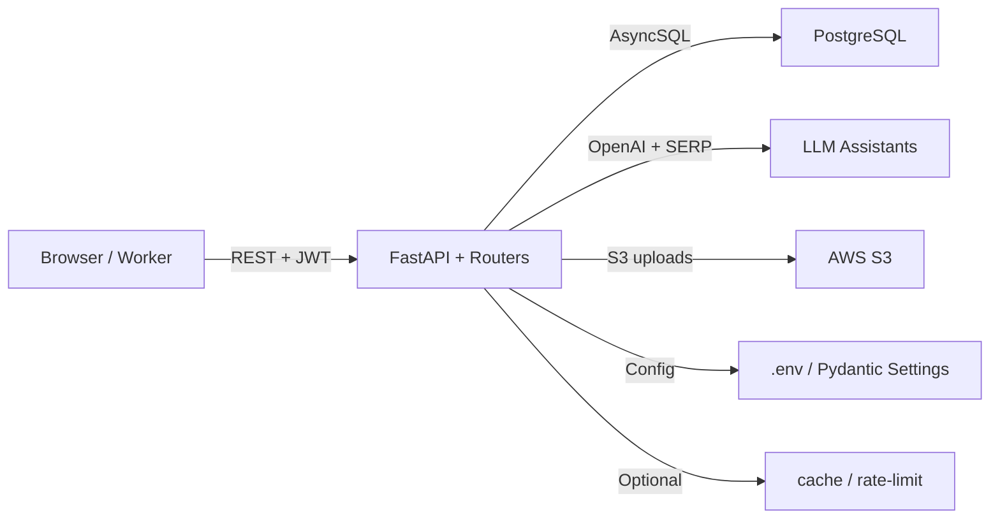

# Pressgen.ai Backend

FastAPI backend for Pressgen.ai’s AI-powered newsroom workflow: ingest sources, collect Q&A, and generate structured news stories with human review.

## Project Overview
(Recruiters: this backend powers the core SaaS workflow for Pressgen.ai, combining asynchronous API endpoints, OpenAI assistants, and editorial tooling so writers and editors can stay productive while the system handles verification, submissions, and publishing.)

## Problem
Newsrooms and small teams struggle to keep up with volume, context, and compliance across cities and beats. This project ingests RSS feeds, surfaces contextual prompts, and orchestrates AI-driven article drafts so human editors only need to review or fine-tune what matters.

## Architecture
- `src/app.py` wires FastAPI with permissive CORS, a `/pressgenai` root path, and routers for stories, editors, creators, auth, admin, news, media, common, and insurance flows.
- Each domain folder follows the router/service/schemas pattern; routers handle HTTP plumbing while `service.py` encapsulates business logic and `schemas.py` defines typed payloads.
- Shared AWS utilities and database configuration live in `src/aws/` and `src/config/`; SQLAlchemy models live in `src/models.py`, and migrations are maintained in `alembic/`.
- Async SQLAlchemy sessions via `src/config/database.py` plus Pydantic-powered `src/config/settings.py` keep configuration, secrets, and dependency injection explicit.

## Tech Stack
- Python 3.12 (FastAPI, Pydantic, SQLAlchemy)
- FastAPI (async endpoints, dependency injection, OAuth2 flows)
- Redis (backing cache/rate-limiting gateways in production)
- PostgreSQL (Asyncpg + Alembic migrations)
- Docker (containerized deployment targets)

## Key Features
- JWT authentication with refresh tokens that gate creator/editor/admin roles via `src/auth/`.
- Async FastAPI APIs for stories, question/answer management, editorial submission, and insurance flows.
- AI story-generation orchestration (OpenAI + SERP) with contextual prompts and human-in-the-loop review; media uploads use AWS S3 presigned URLs.
- Background-friendly ingestion of city-level news sources with structured metadata and enums for categories/publish status.

## System Design
Clients hit `/pressgenai/api/*` routes, which call routers -> services -> async DB sessions. The auth router issues JWTs, the stories/editor routers push contextual prompts to OpenAI, and the media router uses AWS clients to persist files to S3. Services mutate `src/models.py` tables (users, authors, stories, questions, answers, generated articles) and notify editors via publish-status fields. Alembic ensures migrations stay in sync, while shared configs load secrets from `.env`.

## Example API Requests
```bash
curl -X POST http://localhost:8000/pressgenai/api/auth/ \
  -H "Content-Type: application/x-www-form-urlencoded" \
  -d "username=editor@example.com&password=secret"
```
```bash
curl http://localhost:8000/pressgenai/api/stories/{story_id} \
  -H "Authorization: Bearer <access_token>"
```

## Setup Instructions
1. `python -m venv .venv`
2. `\.venv\Scripts\activate`
3. `pip install -r requirements.txt`
4. Copy your `.env` from secure storage (see `src/config/settings.py` for required variables).
5. `uvicorn src.app:app --reload --host 0.0.0.0 --port 8000`
6. `alembic upgrade head` before seeding data for dev work.

## Screenshots / Diagrams

No UI screenshots yet; this repo is backend-only.

## Production Considerations
- **Rate limiting:** Gate sensitive endpoints through API gateway or Redis-backed throttling to protect OpenAI/API costs.
- **Caching:** Use Redis (or CDN) for frequently read metadata like city listings or category enums.
- **Retries & Idempotency:** Design service calls that write to the DB to be idempotent (e.g., `title_hash` constraints) and wrap external API calls (OpenAI, AWS) with retry/backoff.
- **Logging & Monitoring:** Ship structured logs for auth failures, story generation errors, and AWS upload issues; integrate with Sentry/CloudWatch.
- **Background Jobs & Queues:** Long-running ingestion or generation jobs should run asynchronously (FastAPI background tasks, external job queues) instead of blocking request threads.
- **Monitoring:** Track story publish statuses, failed questions/answers, and token freshness to alert on stuck workflows.
- **Security:** Keep secrets in `.env`, rotate JWT/OpenAI keys regularly, and audit role-based fences for admin/creator/editor boards.

## Highlighted Engineering Decisions
- Chose async SQLAlchemy + PostgreSQL/Alembic for predictable migrations and non-blocking DB I/O.
- Centralized config via Pydantic Settings and `settings.ENV` to switch between local/dev/production databases seamlessly.
- Enforced service-layer logic to keep routers as thin wrappers, improving testability and reuse across domains.
- AWS S3 presigned URLs minimize server load for media uploads while keeping objects private.

## Architecture Diagrams
(See the Mermaid diagram above.)

## Project Overview (Recruiter-Friendly Summary)
Pressgen.ai’s backend team delivers the orchestration that lets creators, editors, and insurance writers collaborate with AI safely. It keeps data structured, enforces roles via JWT, manages AWS media, and ensures every generated piece can be audited and published through a controlled workflow. A candidate joining the team will work across FastAPI, async SQLAlchemy, OpenAI tooling, and production ops (migrations, logging, monitoring) to keep the newsroom running smoothly.
